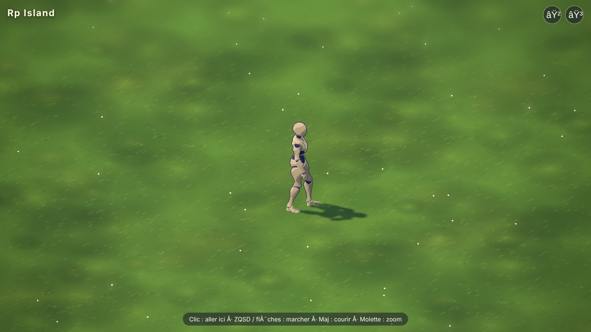

# Rp Island



Monde de RP en 3D dans le navigateur : un créateur de personnage, puis une map (un sol d'herbe)
où le perso créé se promène, en cel shading avec le rendu HD-2D d'Arena Tactic.

## Lancer le jeu

```bash
npm install
npm run dev
```

Puis ouvrir http://localhost:5173. Le jeu s'ouvre sur le créateur de personnage ; « Jouer »
mène à la map, « ✎ Perso » y revient.

- Clic sur le sol : le perso y marche (Maj + clic : il court)
- ZQSD, WASD ou flèches : marcher (Maj : courir)
- Molette : zoom
- Boutons en haut à droite : tourner la caméra d'un quart de tour
- Clic sur un objet : le perso va le prendre en main ; E (ou le bouton « Poser ») : le reposer
  devant lui (sur la table s'il y en a une)
- Livres : en tenant un livre, clic sur d'autres livres pour faire une pile (jusqu'à 6), portée à
  plat ; clic sur la bibliothèque pour les y ranger debout ; clic sur un livre rangé pour le prendre.
  Hors de la bibliothèque, un livre se pose à plat.
- Le perso contourne les meubles (table, bibliothèque) au lieu de les traverser
- Zone de saisie en bas (Entrée pour y écrire, Tab pour changer de mode) :
  - **💬 Parole** : le perso dit la phrase, dans une bulle au-dessus de sa tête ;
  - **✋ Action** : un ordre au perso (« range tous les livres », « fais-toi un café puis bois »),
    qu'il exécute. Le bouton « Arrêter » l'interrompt.
- Cycle jour/nuit : le temps du jeu passe 4 fois plus vite que le vrai (une journée = 6 h réelles).
  Menu → « Heure » : curseur pour changer l'heure à la volée, pause, ×4 ou ×60.
- Besoins du perso (en haut à droite) : fatigue, faim, soif, hygiène, de 100 à 0. Ils baissent
  avec l'heure du jeu, plus vite en marchant ou en courant (la fatigue aussi la nuit) ; boire
  remonte la soif, et un café réveille un peu. Console : `game.needs.set('faim', 10)`.
- Santé (au-dessus des besoins) : elle baisse quand un besoin reste à zéro (la soif fait le plus
  de mal, puis la faim, la fatigue, et un peu l'hygiène) et remonte doucement quand tous les
  besoins sont au-dessus de 30. Console : `game.needs.hurt(20)`, `game.needs.heal(20)`.

### Les ordres

Les ordres simples sont compris directement par le jeu, sans IA (`src/orders/parser.ts`) :
prendre, poser (« pose la lettre sur la table »), ranger (les livres), aller (« va à la table »),
café, boire, dire (« dis bonjour »), enchaînés avec « puis », « ensuite » ou « et ».

Les autres (« mets un peu d'ordre ») passent par un modèle de chat via
[OpenRouter](https://openrouter.ai), par défaut celui de Lumen (`qwen/qwen3.7-flash`). Il choisit
les tâches une par une en voyant l'état de la pièce, et peut répondre en personnage. Il faut une
clé OpenRouter : Menu (☰ ou Échap) → « IA des ordres » (gardée dans le navigateur), ou un
fichier `.env.local` :

```
VITE_OPENROUTER_API_KEY=sk-or-...
VITE_OPENROUTER_MODEL=qwen/qwen3.7-flash
```

**Manques** (`src/orders/missing.ts`, Menu → Manques) : ce que le perso n'a pas pu faire pendant
les essais est noté dans le navigateur, regroupé et compté. Trois sortes : une action ou un objet
que le jeu n'a pas encore (signalé par l'IA avec la tâche « manque », ex. danser), une action
ratée (message du jeu), un ordre non compris sans IA. « Copier » ou « Télécharger » donne la
liste en Markdown, à coller dans la discussion du projet.

Les tâches (`src/orders/tasks.ts`) traduisent un ordre en actions de base selon l'état de la
pièce : ranger les livres = les prendre par piles de 6, les ranger, recommencer tant qu'il en
traîne. L'aperçu publié sur claude.ai ne peut pas joindre OpenRouter : les ordres libres y passent par
Claude (compte de la personne qui joue, qui l'autorise au premier ordre).

`npm run build` produit une version publiable dans `dist/`.

## Le créateur de personnage

Style anime, basé sur les **modèles officiels de VRoid Studio** (pixiv) au format VRM, lus par
la bibliothèque [three-vrm](https://github.com/pixiv/three-vrm) : shader toon MToon (cel shading
avec contours), expressions du visage, cheveux et vêtements qui bougent (ressorts).

12 persos de base (9 féminins, 3 masculins). Chacun fournit trois pièces que l'on mélange :

- **Tenue** : le corps et ses vêtements (gilet et short, uniformes, robes, sweat...).
- **Visage** : yeux, bouche, expressions (du même genre que la tenue).
- **Coiffure** : n'importe laquelle des 12, avec ses mèches à ressorts.
- **Couleurs** : peau, yeux, cheveux (ou couleurs d'origine).
- **Corps** : taille, tête, jambes, carrure. Double-clic sur un curseur : valeur d'origine.
- **Expressions** (neutre, sourire, rire, triste, colère, surprise, peur, dégoût, clin d'œil) et
  clignement automatique des yeux.
- Bouton « Au hasard », export / import du perso en JSON.

Un perso est une **recette** (`src/creator/recipe.ts`) : quelques choix et nombres, sauvegardés
dans le navigateur. C'est aussi ce qu'une IA pourra écrire pour créer des PNJ.

Les animations d'X Bot (repos, marche, course, oui, non...) sont reciblées sur le squelette
humanoïde VRM de chaque perso.

Les modèles (`public/vrm/`, 29 Mo pour 12 persos) sont produits par `tools/build_vrm_assets.py`
(voir `tools/README.md`).

## Organisation

| Fichier | Rôle |
| --- | --- |
| `src/game/Game.ts` | Scène, caméra iso d'Arena Tactic (30°, 45°, orthographique), lumière, commandes |
| `src/game/postfx.ts` | Post-traitement HD-2D repris d'Arena Tactic : contours encrés, bloom, étalonnage, vignettage, + flou de profondeur |
| `src/game/toon.ts` | Matériau cel shading (3 paliers nets + liseré de lumière) |
| `src/game/character.ts` | Perso glTF au squelette Mixamo, animations repos / marche / course |
| `src/game/ground.ts` | Sol d'herbe (texture peinte par programme) |
| `src/game/motes.ts` | Poussières de lumière qui flottent (ambiance) |
| `src/App.tsx` | Interface React : créateur puis map |
| `src/creator/catalog.ts` | Liste des 12 persos de base (tenue, coiffure, genre) |
| `src/creator/vrm.ts` | Chargement des fichiers VRM (three-vrm) |
| `src/creator/avatar.ts` | Assemblage tenue + visage + coiffure de modèles différents, proportions, couleurs |
| `src/creator/retarget.ts` | Reciblage des animations Mixamo sur le squelette VRM |
| `src/creator/puppet.ts` | Perso animé (assemblage + animations + expressions + clignement), partagé créateur / jeu |
| `src/creator/recipe.ts` | La recette d'un perso, bornes des curseurs, palettes |
| `src/creator/Creator.tsx` | Écran du créateur |
| `src/game/items/catalog.ts` | Fiches des objets (portable, type de prise, point saisi) |
| `src/game/items/grips.ts` | Types de prise : pose du bras et des doigts, place de l'objet dans la main |
| `src/game/items/ik.ts` | Bras / jambe à deux os qui amène la main (le pied) sur un point |
| `src/game/items/carry.ts` | Prendre, tenir en marchant, reposer, piles d'objets |
| `src/game/nav.ts` | Contourner les meubles |
| `src/orders/ChatBar.tsx` | Zone de saisie parole / action |
| `src/orders/AiSettingsForm.tsx` | Réglages de l'IA (clé, modèle), dans le menu |
| `src/orders/missing.ts` | Journal des manques (ce que le perso n'a pas pu faire) |
| `src/ui/MissingPanel.tsx` | Menu → Manques : liste regroupée, copier, télécharger, vider |
| `src/ui/Menu.tsx` | Menu déroulant (raccourcis, IA, perso) : une `<MenuSection>` par réglage, ajoutée dans App.tsx |
| `src/orders/parser.ts` | Ordres simples compris sans IA |
| `src/orders/tasks.ts` | Un ordre (ranger les livres, café…) → suite d'actions de base |
| `src/orders/ai.ts` | Ordres libres : modèle de chat via OpenRouter |
| `src/orders/actions.ts` | Actions de base du perso, attente de la fin du geste |

## Les animations

« X Bot » de Mixamo (fourni dans les exemples de three.js) ne sert plus que de source
d'animations : `idle`, `walk`, `run`, `agree` (oui), `headShake` (non), `sad_pose`,
`sneak_pose`. Toute animation Mixamo ajoutée à ce fichier sera jouable par tous les persos.

## Les objets

Chaque objet a une petite fiche dans `src/game/items/catalog.ts`, pas d'animation à lui :

```ts
{ id: 'tasse', name: 'tasse', portable: true, grip: 'fist', gripPoint: [0, 0.055, 0.062], build: () => ... }
```

- `portable` : peut-on le prendre en main.
- `grip` : type de prise, parmi `pinch` (entre les doigts : clé, lettre), `fist` (en poing :
  tasse, épée), `side` (le long du corps : sac, seau), `chest` (contre la poitrine : livre), `stack` (pile à plat, à deux mains), `twoHands` (à deux mains : caisse).
  Sans `grip`, la prise est devinée d'après la taille de l'objet (c'est le cas de la lettre).
- `gripPoint` : le point de l'objet que la main saisit (sinon son centre).

La pose vient du type de prise : les bras sont placés par calcul vers la main voulue (bras à
deux os), les doigts se referment, et l'objet suit l'os de la main. Pour ramasser, le perso se
penche ou s'accroupit selon la hauteur de l'objet. Les jambes gardent l'animation de marche.
Les objets posés sur celui qu'on soulève (une tasse sur la caisse) partent avec lui.

Fiche d'un livre : `stack: 'livre'` (s'empile avec les autres livres), `layFlat: true` (se pose
couché). Un meuble de rangement donne ses places (`slots`), où les objets se rangent debout.

Machine à café : tasse en main, clic sur la machine. Le perso pose la tasse sous le bec, le café
coule, puis il reprend la tasse pleine (« tasse de café »). Fiches : `pour` pour la machine (où
poser le récipient, ce qu'elle remplit, durée), `fill` pour la tasse (hauteur du liquide vide /
pleine ; la tasse commence vide).

Un objet par main : on peut tenir une tasse dans une main et un livre dans l'autre. Une caisse,
une pile de livres ou un livre ouvert prennent les deux mains. E repose le dernier objet pris.

Lire : livre en main (l'autre main libre), bouton « Lire » ou touche L. Le perso ouvre le livre
devant lui à deux mains et penche la tête ; L de nouveau pour le refermer. Prendre ou poser
quelque chose referme le livre d'abord.

Lancer : objet petit ou moyen tenu d'une main (tasse, livre, lettre), bouton « Lancer » ou
touche T. Le bras part en arrière puis fouette, l'objet vole en tournant. Au premier choc il peut
se briser selon sa fragilité (fiche `fragility`, de 1 très fragile à 10 incassable ; tasse 2,
livre 8, lettre 10) et la force du choc : il disparaît en éclats de ses couleurs, et une tasse
pleine laisse une flaque. Sinon il rebondit et se pose (un livre à plat).

Déplacer un gros meuble (fiche `movable` : table, bibliothèque, machine à café) : mains vides,
clic sur le meuble. Le perso se place contre le côté le plus proche et pose les mains dessus ;
Z Q S D le poussent ou le tirent (ce qui est posé ou rangé dedans suit), il bute sur les autres
meubles. E le lâche.

Durabilité : chaque objet a une jauge (fiche `durability`, en points : tasse 40, lettre 30,
livre 100, caisse 150, machine 250, table 300, bibliothèque 400). Elle baisse à l'usage (prendre
l'objet, boire, lire, faire un café, pousser un meuble) et sur les chocs. Grades : neuf, bon état,
usé, abîmé, très abîmé ; plus elle baisse, plus l'objet paraît usé (couleurs ternies, taches,
rayures, bords sombres : `src/game/items/durability.ts`). Un objet usé casse plus facilement
quand on le lance. À zéro il se brise, là où il est ou dans la main (une tasse blesse un peu) ;
ce qui était posé dessus tombe. La souris sur un objet montre son grade et sa jauge. Au départ,
la table, la caisse et deux livres sont déjà usés.

Boire : tasse de café en main, bouton « Boire » ou touche B. Le perso porte la tasse à la bouche,
l'incline et boit une gorgée ; le niveau baisse (environ trois gorgées). Vide, elle se remplit
de nouveau à la machine.

Les meubles (objets non portables) sont des rectangles au sol que le perso contourne
(`src/game/nav.ts`) : il glisse le long au clavier, et un clic de l'autre côté passe par leurs coins.

Depuis la console (et plus tard pour l'IA de RP) : `game.pickUp('tasse')`, `game.drop()` (ou
`game.drop('livre')` pour poser cet objet-là), `game.read()`, `game.stopReading()`, `game.heldNames`,
`game.store()` (ranger les livres tenus), `game.makeCoffee()`, `game.drink()`, `game.throwItem()` (ou `game.throwItem('tasse')`),
`game.conditionOf('tasse')` / `game.setCondition('tasse', 0.3)` (durabilité, 0 à 1),
`game.grab('table')` / `game.release()`, `game.itemNames`.
